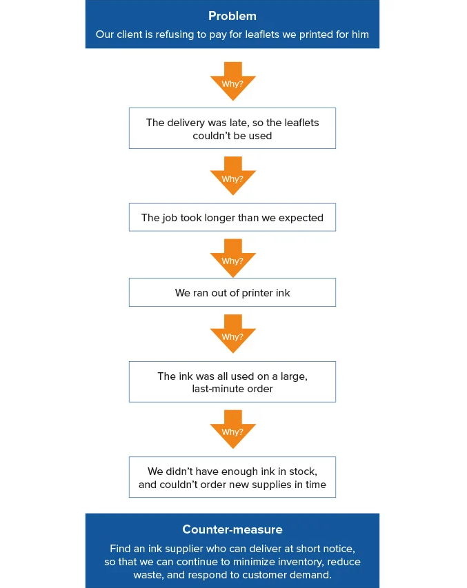

# The 5 Whys
[Table of Contents](README.md)  
[Link to Article](https://www.mindtools.com/pages/article/newTMC_5W.htm)  

This problem solving technique is about asking "Why" five times. Throughout a project, coding, solving a problem you may be doing this already. It might be even more than five times. Why is this not working? Why am I not getting a return? Why is this failing? And the list goes on.  

The goal of this article is to talk about the importance of asking why. The 5 Whys analysis can be using for troubleshooting, quality improvement, and problem solving, but it is most effective when used to resolve simple or moderately difficult problems.  

Sometimes programmers get caught up in a problem and never ask enough why's. I mean you might ask why for the initial problem, but if you continue to ask why to each answer, you may find the underlying issues that are not always visable upfront. Below is a visual aid from the article that really explains this topic.  

