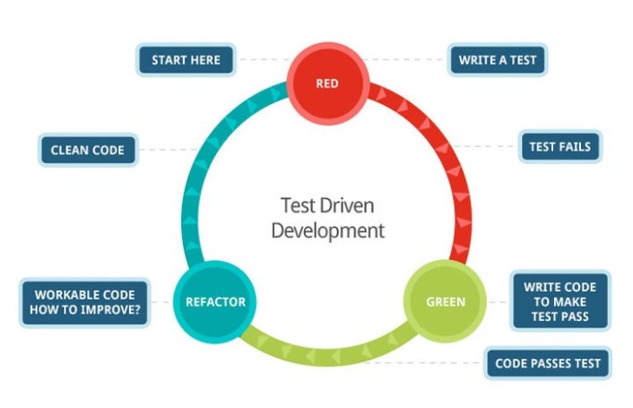

# Class-02 Readings: Classes, Inheritance, Functional Programming  

[Table of Contents](README.md)  

## Reading, Research, and Discussion

### 1. Name 3 advantages to Test Driven Development 
- Greater Code quality
- Detailed Documentation as each piece of code has a strict specification it has to follow  
- Reduces time required for project development as TDD identifies issues fast and as you write your code. One problem at a time vs at the end of a module having 20 pieces failing.  

    - Resource: [codica.com](https://www.codica.com/blog/test-driven-development-benefits/)  

### 2. In what case would you need to use beforeEach() or afterEach() in a test suite?  
- `beforeEach()`:  
    - Before each test, we might want to set up a test database to run tests without affecting the real database.  
- `afterEach()`:  
    - After each test, we might want to tear down that test database to start fresh again.  
- Resource: [jestjs.io](https://jestjs.io/docs/en/api)  

### 3. What is one downside of Test Driven Development  
- Requires a lot of upfront time and effort to think of the possible outcomes / scenarios for your code.  
- It will find bugs for test you wrote, but will not cover those bugs during implementation.  

### 4. What’s the primary difference between ES6 Classes and Constructor/Prototype Classes?  
- Constructors:  
    - They do not belong to a class  
    - They create objects
- Classes:  
    - They utilize constructors to create objects  
    - They inherit all classes properties and attributes
    - If new things are added to class they are available to that object  

### 5. Name a use case for a static method  
- Static methods have no access to data stored in specific objects.  
- A use case could be for a specific class to have a static method that does not need to be a part of a instance of that class but it available to the class in order to create an instance of a class.  
    - Resource: [Medium.com](https://medium.com/@yyang0903/static-objects-static-methods-in-es6-1c026dbb8bb1)  

### 6. Write an example of a Higher Order Function and describe the use case it solves.  

```js

let words = ['oops', 'gasp', 'shout', 'sun']

const filter = (fn, arr) => reduce((acc, curr) => 
    fn(curr) ? acc.concat([curr]) : acc, [], arr
);

const censor = (words) => filter(
  word => word.length !== 4,
  words
);

```  
- Above is an example of a higher order function `filter`. JS gives a lot of built in functions, many you might already know are array.filter, array.map, array.reduce.... All these are higher order functions. Array.filter takes in an array and will execute reduce and filter the words in this example. So censor function can just use filter instead of having to loop, or do any of the business logic. We are passing in a function and an array and it will return us filtered words.  
- Resource: [medium.com](https://medium.com/javascript-scene/higher-order-functions-composing-software-5365cf2cbe99)  

---

## Vocabulary Terms  

- `functional programming` :  
    - The process of building software by composing 'pure functions', avoiding 'shared state', 'mutable data' and 'side-effects'.  
    - Functional programming is 'declarative' rather than 'imperative' and application state flows through pure functions.  
        - Resource: [medium.com](https://medium.com/javascript-scene/master-the-javascript-interview-what-is-functional-programming-7f218c68b3a0)  
- `pure function` :  
    - A function that is given the same inputs, always returns the same output.  
    - Has no side-effects   
        - Resource: [medium.com](https://medium.com/javascript-scene/master-the-javascript-interview-what-is-functional-programming-7f218c68b3a0)  
- `higher-order function` :  
    - A function that takes a function as an argument, or returns a function. Higher order function is in contrast to first order functions, which don't take a function as an argument or return a function as output.  
        - Resource: [medium.com](https://medium.com/javascript-scene/higher-order-functions-composing-software-5365cf2cbe99)  
- `immutable state` :  
    - Refers to an unchangle piece of code , or state of an object
        - Resource: [medium.com](https://medium.zenika.com/immutability-in-javascript-7e1a19b45615)  
- `object` :  
    - An object is a collection of properties, and a property is an association between a name (key) and a value.  
        - Resource: [MDN docs](https://developer.mozilla.org/en-US/docs/Web/JavaScript/Guide/Working_with_Objects)  
- `object-oriented programming (OOP)` :  
    - Programming model that organizes software design around data/objects instead of functions/logic.  
        - Resource: [SearchApp Architecture](https://searchapparchitecture.techtarget.com/definition/object-oriented-programming-OOP)  
- `class` :  
    - Classes are in fact "special functions", and just as you can define function expressions and function declarations, the class syntax has two components: class expressions and class declarations.  
        - Resource: [MDN Class](https://developer.mozilla.org/en-US/docs/Web/JavaScript/Reference/Classes)  
- `prototype` :  
    - Prototypes are the mechanism by which JavaScript objects inherit features from one another.  
        - Resource: [MDN Object prototypes](https://developer.mozilla.org/en-US/docs/Learn/JavaScript/Objects/Object_prototypes)  
- `super` :  
    - super is a keyword, used to access and call functions on an objects parent.  
        - Resource: [MDN super](https://developer.mozilla.org/en-US/docs/Web/JavaScript/Reference/Operators/super)  
- `inheritance` :  
    - This is the process when a sub element or child element gains attributes, methods, properties etc from its parent element. They inherit those abilities.  
        - Resource: [MDN Inheritance and Prototype](https://developer.mozilla.org/en-US/docs/Web/JavaScript/Inheritance_and_the_prototype_chain)  
- `constructor` :  
    - The constructor method is a special method of a class for creating and initializing an object of that class.   
        - Resource: [MDN constructor](https://developer.mozilla.org/en-US/docs/Web/JavaScript/Reference/Classes/constructor)  
- `instance` :  
    - An instance in javaScript refers to an object that was created using a particular constructor function. That object is an instance of that constructor/class.  
        - Resource: [MDN Object Model](https://developer.mozilla.org/en-US/docs/Web/JavaScript/Guide/Details_of_the_Object_Model)  
- `context` :  
    - Context is related to objects. It refers to the object in which the function belongs too. The keyword "this" is used to refer to the object which the function belongs too and that is the context of that function.  
        - Resource: [MDN Object Model](https://developer.mozilla.org/en-US/docs/Web/JavaScript/Guide/Details_of_the_Object_Model) 
- `this` :  
    - 'This' is a keyword in JavaScript that refers the method, function, class, or constructor its a part of. It will refer to the parent from the location it is called from.
        - Resource: [MDN this](https://developer.mozilla.org/en-US/docs/Web/JavaScript/Reference/Operators/this)  
- `Test Driven Development (TDD)` :  
    - Test Driven Development is a software development practice enabling developers to create proper specifications about how their code should be written and implemented. Fundamentally, TDD is a practice when a programmer writes a functional test before building a code.  
        - Resource: [codica.com](https://www.codica.com/blog/test-driven-development-benefits/)  
- `Jest` :  
    - Jest is a delightful JavaScript testing framework with a focus on simplicity.  
    - It works with projects using: Babel, TypeScript, Node, React, Angular, Vue, and more!  
        - Resource: [jestjs.io](https://jestjs.io/)  
- `Continuous Integration (CI)` :  
    - Software development practice where developers regularly merge their code into a central repository, after which automated builds and tests are run.  
        - Resource: [aws.amazon.com](https://aws.amazon.com/devops/continuous-integration/)  
- `unit test` :  
    - Unit test / testing is the level of software testing where individual units/ components of a software are tested.  
        - Resource: [softwaretestingfundamentals.com](http://softwaretestingfundamentals.com/unit-testing/)  

    
---

## Additional Resources  

### Videos  
- [TDD in JS](http://www.letscodejavascript.com/)  
- [javascript context tutorial](https://www.youtube.com/watch?v=fjJoX9F_F5g)   

### Bookmark / Skim  
- [MDN inheritance](https://developer.mozilla.org/en-US/docs/Web/JavaScript/Inheritance_and_the_prototype_chain)  
- [MDN this](https://developer.mozilla.org/en-US/docs/Web/JavaScript/Reference/Operators/this)  
- [MDN class](https://developer.mozilla.org/en-US/docs/Web/JavaScript/Reference/Classes)  
- [node error docs](https://nodejs.org/dist/latest-v6.x/docs/api/errors.html)  
- [jest docs](https://jestjs.io/docs/en/getting-started)  
