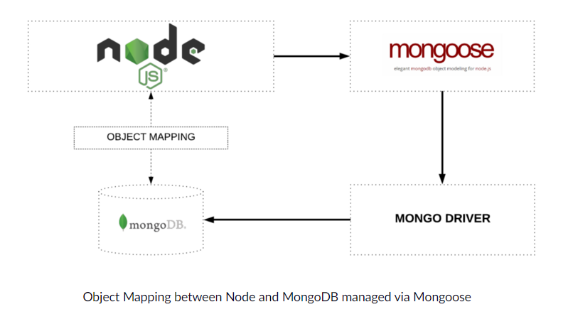
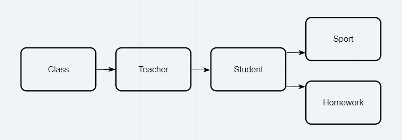

# Class-04 Readings: Advanced Mongo/Mongoose

[Table of Contents](README.md)  

## Reading, Research, and Discussion

### 1. Why would a developer choose to make data models?
- Data models are the building plans which help build a conceptual model and set the relationship between data items.  
- Helps understand what data you are handling and how it is to be handle, along with by who and for who.  
- Resource: [guru99.com](https://www.guru99.com/data-modelling-conceptual-logical.html)  

### 2. What purpose do CRUD operations serve?
- Create, Read, Update, and Delete (CRUD) are the four basic functions that models should be able to do.  
- `Create`: Creates a new record within a data model / database.  
- `Read`: Reads records from a data model / database.  
- `Update`: Updates records in a data model / database.  
- `Delete`: Deletes a record from a data model / database.  
- Resource: [codecademy.com](https://www.codecademy.com/articles/what-is-crud)  

### 3. What kind of database is Postgres? What kind of database is MongoDB?
- `Postgres`: An object-relational SQL database  
    - Resource: [postgresql.org](https://www.postgresql.org/about/)  
- `MongoDB`: An document-oriented NoSQL database used for high volume data storage.  
    - Resource: [guru99.com](https://www.guru99.com/what-is-mongodb.html)  

### 4. What is Mongoose and why do we need it?
- Mongoose is an Object Data Modeling (ODM) library for MongoDB and Node.js. It manages relationships between data, provides schema validation, and is used to translate between objects in code and the representation of those objects in MongoDB.    
  
- Mongoose main advangtage is abstraction. When working with the mongoDB we are working with raw data, documents, JSON data. Mongoose creates a model which makes it easier to work with and makes it look like we are working with objects over pure data.  
- Resource: [freecodecamp.org](https://www.freecodecamp.org/news/introduction-to-mongoose-for-mongodb-d2a7aa593c57/)  

### 5. Describe how NoSQL Databases scale horizontally
- NoSQL Databases are designed to expand horizontally, meaning that you scale by adding more machines in your pool of resources. Relational Databases scale vertically, meaning they scale by increasing server hardware power.  

### 6. Give one strong argument for and against NoSQL Databases
- `for`: NoSQL has no schema, meaning the format of the data saved can be changed at any time.  
- `Against`: NoSQL is open source, and no two NoSQL databases are equal. Meaning you have to learn each version if you plan on switching around databases.  

### 7. Define three related pieces of data in a possible application. An example for a store application might be Product, Category and Department. Describe the constraints and rules on each piece of data and how you would relate these pieces to each other. For example, each Product has a Category and belongs in a Department.
  
- Referencing the data model above each block represents a different table.  
- The relationship goes from left to right and reads as so:  
    - `Class`: This would be maybe Math, Reading, 201, 301, etc... It has properties that are specific to that subject of learning. It only knows about teachers, teaches assigned to teach that subject, it does not know anything about students, homework, or sport.  
    - `Teacher`: Just like class has properties for what it is to be a teacher, but its relationship is only with student. It can't look back and see class, it only knows about itself and the students assigned to them.  
    - `Student`: Same as teacher, it knows itself and whats ahead, homework and sports.  
    - `Homework/Sport`: These are tables that hold information about themselves. For example, in homework there might be a record for reading assignment 03. Homework only knows about itself, nothing else.  

#### 8. Name 3 cloud based NoSQL Databases
- Oracle NoSQL Database  
- DynamoDB by Amazon Web Services  
- Atlas: MongoDB Company  

---

## Vocabulary Terms  

- `database` :  
    - A usually large collection of data organized especially for rapid search and retrieval(as by a computer)  
        - Resource: [merriam-webster.com](https://www.merriam-webster.com/dictionary/database)  
- `data model` :  
    - A data model is a conceptual representation of data objects, the associations between different data objects and the rules. Data modeling is the process of creating a data model for the data to be stored in a database.  
        - Resource: [guru99.com](https://www.guru99.com/data-modelling-conceptual-logical.html) 
- `CRUD` :  
    - Create, Read, Update, and Delete (CRUD) are the four basic functions that models should be able to do.  
        - Resource: [codecademy.com](https://www.codecademy.com/articles/what-is-crud)  
- `schema` :  
    - A schema is the organization or structure for a database.  
        - Resource: [SearchSQLServer](https://searchsqlserver.techtarget.com/definition/schema)    
- `sanitize` :  
    - Sanitizing will remove any illegal characters from the data.  
    - to free from dirt, germs, etc., as by cleaning or sterilizing.  
        - Resource: [medium.com](https://medium.com/@abderrahman.hamila/what-sanitize-mean-and-why-sanitize-in-code-data-5c68c9f76164)  
- `Structured Query Language (SQL)` :  
    - Standardized query language for requestion information from a database.  
        - Resource: [webopedia.com](https://www.webopedia.com/TERM/S/SQL.html)  
- `Non SQL (NoSQL)` :  
    - A non relational database that stores and accesses data using key-values.  
    - Non SQL databases do not require a schema, providing a more flexible approach to storing data than a relational database.  
        - Resource: [techterms.com](https://techterms.com/definition/nosql)   
- `MongoDB` :  
    - An document-oriented NoSQL database used for high volume data storage.  
        - Resource: Resource: [guru99.com](https://www.guru99.com/what-is-mongodb.html)  
- `Mongoose` :  
    - Mongoose is an Object Data Modeling (ODM) library for MongoDB and Node.js. It manages relationships between data, provides schema validation, and is used to translate between objects in code and the representation of those objects in MongoDB.   
        - Resource: [freecodecamp.org](https://www.freecodecamp.org/news/introduction-to-mongoose-for-mongodb-d2a7aa593c57/)  
- `record` :  
    - A record is a database entry that may contain one or more values. Groups of records are store din a table, which defines what types of data each record may contain.  
        - Resource: [techterms.com](https://techterms.com/definition/record)  
- `document` :  
    - A computer document is a file created by a software application. It is used to refer to all types of saved files. Document may contain text, images, audio, video, and other types of data.   
        - Resource: [techterms.com](https://techterms.com/definition/document)  
- `Object Relation Mapping (ORM)` :  
    - Object-relational mapping is a mechanism that makes it possible to address, access, and manipulate objects without having to consider how those objects relate to their data sources.  
        - Resource: [techtarget.com](https://searchwindevelopment.techtarget.com/definition/object-relational-mapping)  

---

## Additional Resources  

### Cloud Databases  
There are a few alternatives to running Mongo locally for your web servers  
- [Mlab](https://www.mlab.com/) :  remotely hosted mongoDB systems. Easily setup a free database (or pay for more horsepower). Works great with Heroku  
- [Atlas](https://www.mongodb.com/cloud/atlas) : Cloud based, highly scalable Mongo DB  
- [DynamoDB](https://aws.amazon.com/dynamodb/) : AWS NoSQL Database. Very highly scalable. Also provides a ‘mongoose’-like ORM called ‘dynamoose’  
- [CosmosDB](https://cosmos.azure.com/) : The Microsoft Azure equivalent for Atlas and Dynamo  

### Bookmark / Skim  
- [In Memory Database Testing](https://dev.to/paulasantamaria/testing-node-js-mongoose-with-an-in-memory-database-32np)  
- [The Repository Design Pattern](https://cubettech.com/resources/blog/introduction-to-repository-design-pattern/)  
- [Mongo memory server](https://www.npmjs.com/package/mongodb-memory-server)  
- [Supergoose](https://www.npmjs.com/package/@code-fellows/supergoose)  