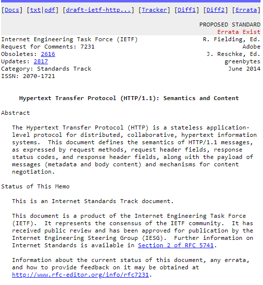
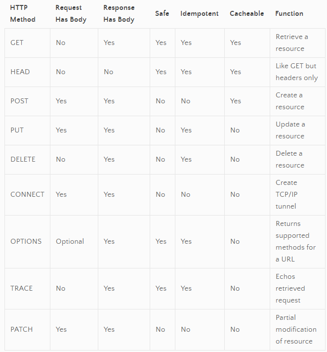
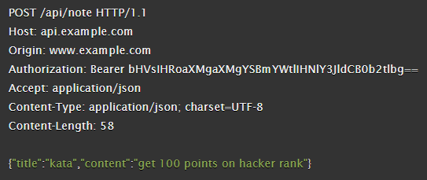
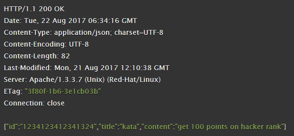
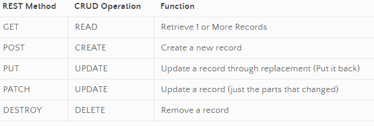

# Class-06 Readings: HTTP and REST

[Table of Contents](README.md)  

## Reading, Research, and Discussion

### HTTP
-   

HTTP is often associated with serving `.html` files but also used to transfer images, videos, `.json`, `.xml`, binary executables, and more.  

---

### HTTP Requests  
- A HTTP/1.1 request is formatted in text and transferred using TCP  
- The first line of the request contains `METHOD`, `URL`, and `HTTP VERSION`.  

-   

- Example Request: 
    - 

### HTTP Response  
- A HTTP/1.1 response is also formatted in text and transferred using TCP.  
- The first line of the response contains the `HTTP VERSION`, `STATUS CODE`, and `STATUS MESSAGE`.  

- Example Response: 
    - 

### REST

- Means... by which we can reference, manipulate, and trasfer state. 
- A `RESTful Endpoint` is a URL that identifies the resource. When addressed with a proper method, you are able to effect state. In normal terms, this means "Performing CRUD operations over HTTP".  

- RESTful Endpoint: `http://api.server.com/api/v1/people`  
    - `http://`: Protocol/Scheme  
    - `api.server.com`: Domain or Server 
    - `/api/v1`: API Endpoint  
    - `/people`: The resource (This identifies a collection: all people)  
    - `people/12345`: A more specific resource: The person with id 12345.  

- REST / CRUD Connections  
    -   

- RESTful endpoints generally deliver data in JSON format.  

### REST Documentation (Swagger)  
- Open API formally known as Swagger, is a documentation service. It helps document all the routes / paths / HTTP requests that can be made to an API. 

---

## Vocabulary Terms  

- `HTTP` :  
    - Hyper Text Transfer Protocol is a stateless request-response application layer protocol.   
        - Resource: Provided Canvas Readings
- `TCP` :  
    - Transmission Control Procress is a standard that defines how to establish and maintain a network conversation through which application programs can exchange data.
        - Resource: [techtarget.com](https://searchnetworking.techtarget.com/definition/TCP)
- `REST` :  
    - Representational State Transfer
        - Resource: Provided Canvas Readings

    
---

## Additional Resources  

### Videos  
- [HTTP and REST](https://www.youtube.com/watch?v=Q-BpqyOT3a8)    

### Bookmark / Skim  
- [HTTP Basics](https://code.tutsplus.com/tutorials/http-the-protocol-every-web-developer-must-know-part-1--net-31177)  
- [What is REST](https://restfulapi.net/)  
- [swagger docs](https://swagger.io/docs/) 
- [swagger editor](https://editor.swagger.io/) 
- [HTTP reference](https://code-maze.com/the-http-reference/) 
- [REST reference](https://www.restapitutorial.com/lessons/httpmethods.html)  
